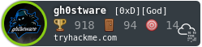

# Nehal Zaman
### 19 y.o | learner
 
Myself Nehal. A wannabe security researcher and cyber-security enthusiast.

I am CSE student at **Vellore Institute of Technology**, Bhopal with specialisation in Cyber-security and Digital Forensics.

In this site, you will find blogs about different concepts in the field of security and writeups of many CTF challenges in different platforms like HackTheBox, TryHackMe, VulnHub and many more.

Hope you will like them :)

### Badges

